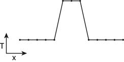
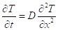
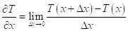
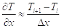
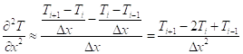
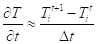
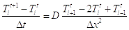
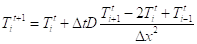
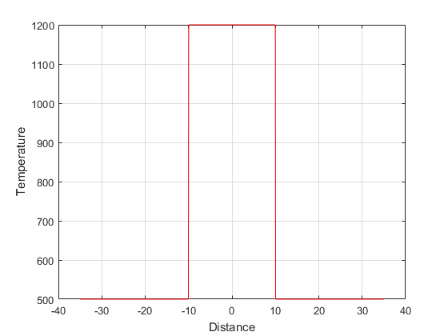

# tee_ai
A simple 1D finite difference script to model the thermal effect of an intrusion in Matlab.

### Motivation

Numerical modelling is often considered black magic. Here I give a short intro into how to develop a finite difference method model for thermal diffusion. The problem that we address is geologically motivated, i.e. a hot intrusion is emplaced in a cooler host rock and we analyze the cooling process. The initial configuration of the model is shown below where we have already discretized the model into 13 points. The intrusion in the central part
of the domain is initially hot (T_int). The rest of the model is at ambient temperature (T_amb).



### Governing Equation

To model the problem of interest we need to know the governing equation, which in our case is the 1D heat diffusion equation. Assuming constant conductivity we can write it as:


 
Where t is the time and D is the diffusivity.

### Finite Difference Approximation

The nice thing about numerical modelling is that one has to remember only very few things. In our case the definition of a derivative:



While this equality strictly speaking only holds for infinitely small delta x, it is likely to also work for reasonably
large delta x values. Using index notation we can express the finite difference approximation of the first spatial derivative as:



Now, in the above equation we need a second spatial derivative, which is simply the derivative of a derivative. Following the logic developed so far we write



The term on the left hand side of the governing equation is a first derivative with respect to time. We already know the drill:



Here I introduce superscripts to distinguish new temperatures <sup>t+1</sup> from current temperatures <sup>t</sup> at spatial point <sub>i</sub>. 

We now have finite difference approximations for both sides of the original equation. Only thing left to do is to decide if we want to call the temperatures on the right hand side current or new. For simplicity we call them current (this makes this an explicit scheme), which yields:



Separating current and new temperatures we obtain:



Hence we now know how to obtain new temperature as a function of the current ones. The implementation in Matlab is straightforward. It is implemented in tee_ai.m and shown at the end of this document.

### Result
The resulting time evolution of the cooling intrusion problem:


### Final Thoughts
We have taken several shortcuts. In reality the intrusion and the host material may have different conductivities, densities, and heat capacities, resulting in a more complicated governing equation. We should also include the effect of the latent heat. In addition, the problem may have a more complicated geometry and we don't get away with a simple 1D model. However, the basic approach remains the same. In finite differences it is all about T<sub>i+1</sub>, T<sub>i</sub>, T<sub>i-1</sub>.

### Matlab Implementation
```Matlab
% User Input
T_int       = 1200;   % Intrusion temperature
T_amb       = 500;    % Ambient temperature

D           = 1e-6;   % Diffusivity

i_width     = 20;     % Intrusion width
model_width = 70;     % Model width
nx          = 1000;   % Number of points in x

nt          = 300000; % Number of timesteps
dt          = 60;     % Timestep

% Geomtery
x   = linspace(-model_width/2, model_width/2, nx);
dx  = x(2)-x(1);

% Initial Condition
T   = T_amb*ones(1,nx);
T(abs(x)<i_width/2)  = T_int;

% Plot Initial Conditions
figure(1)
clf;
plot(x, T, 'r-');
xlabel('Distance');
ylabel('Temperature');
hold on;
grid on;

% Time Loop
T_NEW   = T;
for t=1:nt
    for i=2:nx-1
        T_NEW(i)    = T(i) + dt*D/dx^2*(T(i+1)-2*T(i)+T(i-1));
    end
    
    % Occasionally plot progress
    if (mod(t,5000)==0)
        plot(x, T_NEW, '-b');
        title(['Time: ', num2str(t*dt/3600, '%5.2f'), ' [hours]']);
        drawnow; % Force drawing
    end

    T   = T_NEW;
end
```